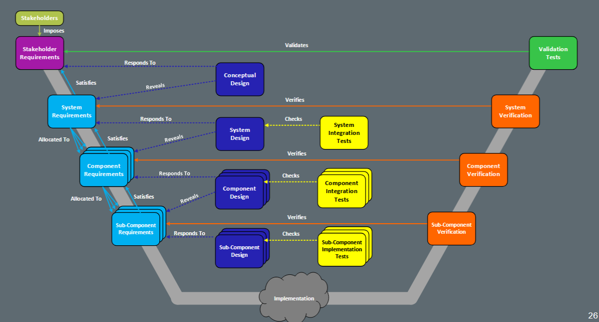

# Introduction to Systems Engineering

## What is a System (INCOSE)

A System is an integrated set of elements, subsystems, or assemblies that accomplish a defined objective

These elements include products (hardware, software, firmware), processes, people, information, techniques, facilities, services, an other support elements.

Systems:
- Have inputs and outputs
- Use resources
- Perform a function
- Comprised of interacting functional elements
- Can be very complex
- May have emergent properties

## Emergent Properties

- Not a property of any component of that system but still a feature of the system as a whole

- An application exhibits behaviours that cannot be identified through functional decomposition: the system is more than a sum of its component parts

### Examples

|System|Components|Emergent Property|
|---|---|---|
|The Brain|Neurons|Consciousness|
|The Internet|Computers|Buiness models, social division..|

### Simple, Complicated, Complex or Chaotic?

- Simple: Domain of best practice: 'known knowns'

- Complicated:: Domain of experts: 'known unknowns'

- Complex: Domain of emergence: 'unknown unknown'

- Chaotic: Domain of rapid response: 'unknowables'

## What is Systems Engineering

An interdisciplinary approach and means to enable the realiszation of successful systems

It focuses on defining customer needs and required functionality early in the development cycle, documenting requirements, and then processding with design syntehsis and system validation while considering the complete problem: operations, cost and schedule, performance, training ad support, test, mannufacturing and disposal

SE considers both the business and the technical needs of all customers with the goal of providing a quality product that meets the user needs

## Why is SE important

Many big projects fail due to not meeting customer needs, specification creep (leading to cost overuns), interface problems, poor communications.

## The SE process

- Evaluation of the need or Problem
- Understanding your customer/client's needs
- Bounding of the problem (system)
- Functional Analysis
- Analysis, capturing and management of requirements
- System Level architectural design 
- Performance analysis and modelling
- Realisation of solution
- Verification and test
- Validation

## The 'V' Model

