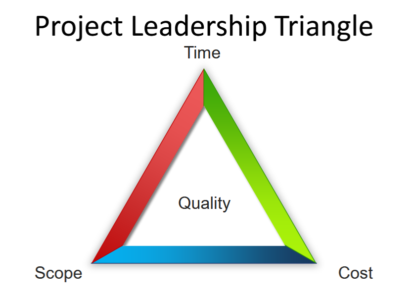
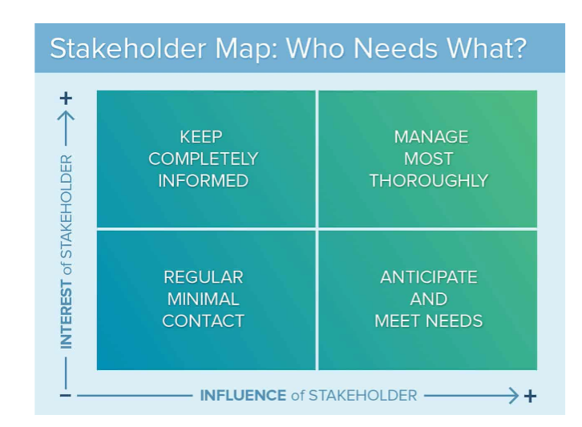
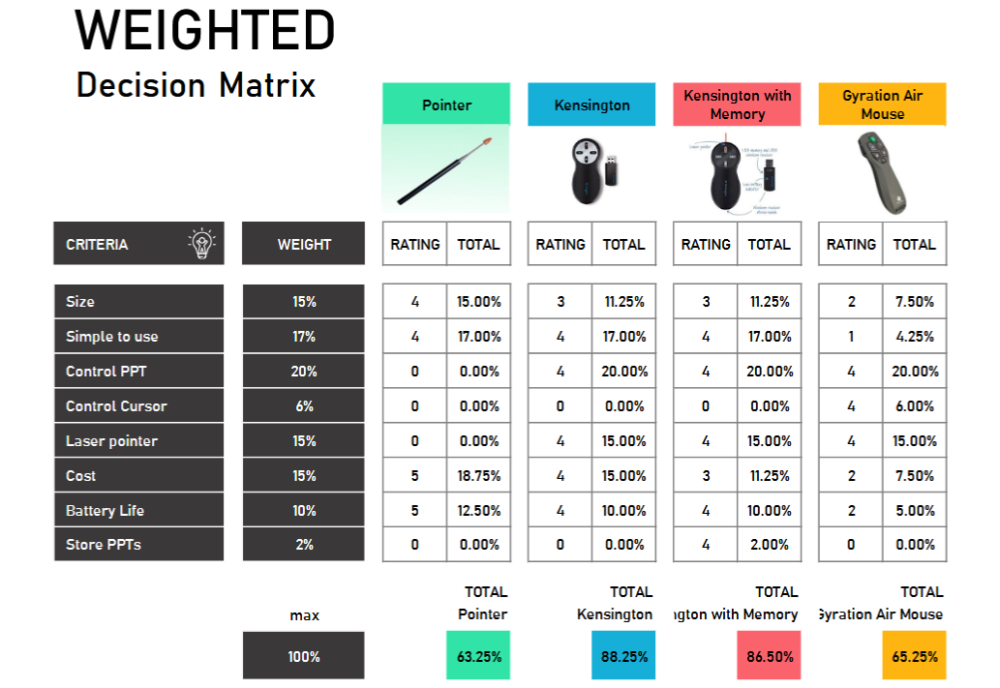
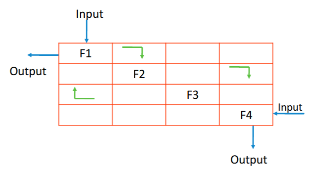

# The Skills and Tools of the Systems Engineer

## Tools of the SE

- Requirement Analysis
- Systems Architectural Design
- Value Analysis
- Risk Management
- Failure Modes Analysis
- EM Compatibility
- Performance Analysis and modelling
- Systems Budgeting and Optimisation
- Activity and Sequence Diagrams
- Communications Diagrams
- State Machine Diagrams
- Use Case Analysis

## Systems Thinking

Systems thinking is a framework for seeing interrelationships rather than things

## Characteristics of a good SE

Key Skills and Behaviours

- Coaching 
- Communications
- Knowing when to ask
- Multi-level thinking, what the fuck does that even mean
- Negotiation
- Team Working

## Techniques of SE

### Requirement analysis

Requirement: A statement that identifies a product or process operational, functional, or design characteristic or contraint which is unambiguous, testable or measurable, and necessary or the product of process acceptability (by customers or internal quality assurance guidelines).

The activities required to:

- Capture and Validate hte system specific required characteristics based on hte analysis of:
    - stakeholder needs,
    - requirements and objectives
    - mission/operation
    - projected utlisiation environment for 
        - people
        - Product
        - Processes
    - Constraints
    - Measures of effectiveness for the system

### Stakeholder Analysis

Who is a Stakeholder:
- Within the project: PM, dev, user
- Within the org: IT manager, accounting, senior man.
- Outside the org: customer, vendor, state regulators, pressure group

Goal is to balance the type and frequency of contact with the influence and interest of the stakeholder.

## Why do we need good requirements

- Important that the customer's requirements are mature and at the correct level
- Good Requirements = Lead to systems that 'fit-for-purpose'
- Requirements need to be validated earlier rather than later
- Incorrect requirements at the early staeg of the life-cycle will be discovered very late in the project, and will be very expensive to rectify

## What is functional analysis

The SE process that 
- Translates stakeholder needs into a sequenced and traceable functional architecture
- The deliverable = functional description
- Build the right product right

## Weighted decision matrix

## Work Breakdown Structure (WBS)

- A tool used to define and group a project's discrete work elements in a way that helps organise and define the total work scope
- A work breakdown structure element may be a product, data, a service, or any combination
- A WBS also provides the necessary framework for detailed cost estimating and control along with providing guidance for schedule development and control
- Most importantly the WBS should be based on the PBD

## Interface Control: N2 Diagram

- Visual matrix representing functional and physical interfaces between system elements
- Flows go clockwise

